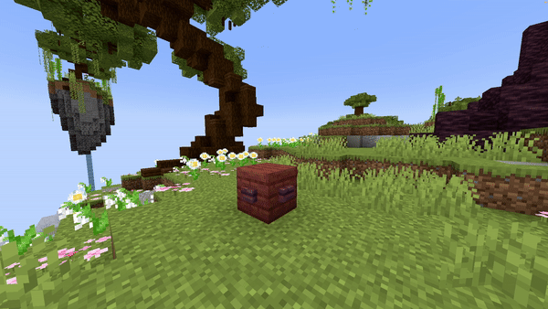

# Activator

## Parameters

<table><thead><tr><th width="126">Parameter</th><th width="370">Information</th><th>Example</th></tr></thead><tbody><tr><td>Location</td><td>The location to spawn the redstone torch in the format of <code>world, x, y, z</code></td><td><code>world, 196, 64, -381</code></td></tr><tr><td>Duration</td><td>The amount of time the redstone torch will stay at that location in ticks.</td><td><code>20</code></td></tr><tr><td>Delay</td><td>The amount of ticks this effect waits after the show starts before its activation.</td><td><code>40</code></td></tr></tbody></table>

<details>

<summary>YML Preset</summary>


```yaml
'1':
  Type: ACTIVATOR
  Location: world, 0, 0, 0
  Duration: 5
  Delay: 0
```


</details>

## Preview

<figure><figcaption></figcaption></figure>

## Youtube Tutorial


