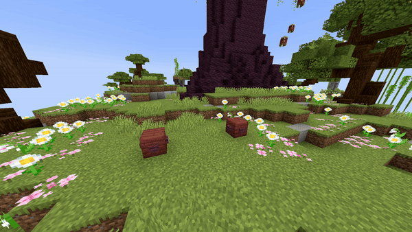

# Block Line

## Parameters

<table><thead><tr><th width="153.33333333333331">Parameters</th><th width="375">Information</th><th>Example</th></tr></thead><tbody><tr><td>FromLocation</td><td>The start location of the fountain in the format of <code>world, x, y, z</code>.</td><td><code>world, 196.3, 64, -381.8</code></td></tr><tr><td>ToLocation</td><td>The location it moves towards in the format of <code>world, x, y, z</code>.</td><td><code>world, 201.3, 64, -381.8</code></td></tr><tr><td>Block</td><td>The <a href="https://hub.spigotmc.org/javadocs/bukkit/org/bukkit/Material.html">block</a> to use as falling block. Items will not work!</td><td><code>BLUE_STAINED_GLASS</code></td></tr><tr><td>BlockData</td><td>The <a href="https://minecraft.wiki/w/Block_states">block data</a> of the block (if it has any). For example an open gate, a rotated stair, ... Use <code>[]</code> to set none.</td><td>[open=true]</td></tr><tr><td>Speed</td><td>The speed the origin moves from the first location to the second one. Measured in <code>blocks/s</code></td><td><code>5</code></td></tr><tr><td>Duration</td><td>The amount of ticks each block will stay.</td><td><code>40</code></td></tr><tr><td>Delay</td><td>The amount of ticks this effect waits after the show starts before its activation.</td><td><code>40</code></td></tr></tbody></table>

<details>

<summary>Yaml Preset</summary>


```yaml
'1':
  Type: BLOCK_LINE
  FromLocation: world, 0, 0, 0
  ToLocation: world, 0, 3, 0
  Block: BLUE_STAINED_GLASS
  BlockData: []
  Speed: 1
  Duration: 40
  Delay: 0
```


</details>

## Preview

<figure><figcaption></figcaption></figure>

## Youtube Tutorial

Doesn't exist yet.
