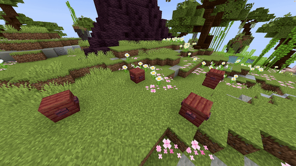

# Block Path

## Parameters

<table><thead><tr><th width="153.33333333333331">Parameters</th><th width="375">Information</th><th>Example</th></tr></thead><tbody><tr><td>Path</td><td><p>The path the origin of the fountain follows using the format of </p><p><code>world, x1, y1, z1; x2, y2, z2; x3, y3, z3</code>. You can of course repeat this process as much as you would like. <strong>Use a ; to separate different locations</strong>.</p></td><td><code>world, 196.3, 64, -381.8; 199.3, 65, -375.8; 205.8, 61, -361.8</code></td></tr><tr><td>Block</td><td>The <a href="https://hub.spigotmc.org/javadocs/bukkit/org/bukkit/Material.html">block</a> to use as falling block. Items will not work!</td><td><code>BLUE_STAINED_GLASS</code></td></tr><tr><td>BlockData</td><td>The <a href="https://minecraft.wiki/w/Block_states">block data</a> of the block (if it has any). For example an open gate, a rotated stair, ... Use <code>[]</code> to set none.</td><td>[open=true]</td></tr><tr><td>Speed</td><td>The speed the origin moves over the path. Measured in <code>blocks/s</code>.</td><td><code>5</code></td></tr><tr><td>Duration</td><td>The amount of ticks each block will stay.</td><td><code>40</code></td></tr><tr><td>Smooth</td><td>Whether the animation of the path should be smooth or not. Can be set to <code>true</code> or <code>false</code>.</td><td><code>true</code></td></tr><tr><td>Delay</td><td>The amount of ticks this effect waits after the show starts before its activation.</td><td><code>40</code></td></tr></tbody></table>

<details>

<summary>Yaml Preset</summary>


```yaml
'1':
  Type: BLOCK_PATH
  Path: 'world, 0, 0, 0; 3, 3, 3' 
  Block: BLUE_STAINED_GLASS
  BlockData: []
  Speed: 1
  Duration: 40
  Smooth: true
  Delay: 0
```


</details>

## Preview

<figure><figcaption></figcaption></figure>

## Youtube Tutorial

Doesn't exist yet.
