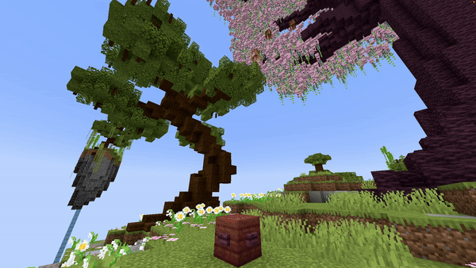

# Falling Block

## Parameters

<table><thead><tr><th width="128.33333333333331">Parameter</th><th width="413">Information</th><th>Example</th></tr></thead><tbody><tr><td>Location</td><td>The location to spawn the redstone torch in the format of <code>world, x, y, z</code>.</td><td><code>world, 196.5, 64, -381.5</code></td></tr><tr><td>Velocity</td><td>Sets the velocity of falling blocks. This is used to launch falling blocks in a specific direction. Don't set these values too high (I would say around a maximum of 10). Follows the pattern of <code>x, y, z</code>.</td><td><code>0.5, 1.3, 0</code></td></tr><tr><td>Block</td><td>The <a href="https://hub.spigotmc.org/javadocs/bukkit/org/bukkit/Material.html">block</a> to use as falling block. Items will not work!</td><td><code>STONE</code></td></tr><tr><td>BlockData</td><td>The <a href="https://minecraft.wiki/w/Block_states">block data</a> of the block (if it has any). For example an open gate, a rotated stair, ... Use <code>[]</code> to set none.</td><td><code>[open=true]</code></td></tr><tr><td>Delay</td><td>The amount of ticks this effect waits after the show starts before its activation.</td><td><code>40</code></td></tr></tbody></table>

<details>

<summary>YML Preset</summary>


```yaml
'1':
  Type: FALLING_BLOCK
  Location: world, 0, 0, 0
  Velocity: 0, 0, 0
  Block: STONE
  BlockData: []
  Delay: 0
```


</details>

## Preview

<figure><figcaption></figcaption></figure>

## Youtube Tutorial


