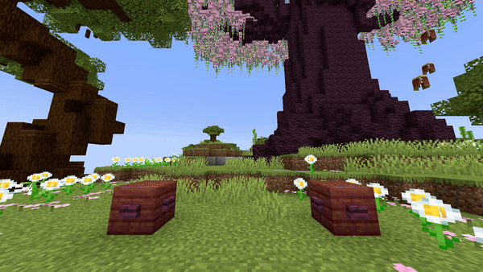

# Fill Block

## Parameters

<table><thead><tr><th width="163">Parameter</th><th width="371.3333333333333">Information</th><th>Example</th></tr></thead><tbody><tr><td>FromLocation</td><td>The first location, comparable with the first location of the <a href="https://minecraft.wiki/w/Commands/fill">/fill</a> command. Follows the patern of <code>world, x, y, z</code>.</td><td><code>world, 196, 64, -381</code></td></tr><tr><td>ToLocation</td><td>The second location, comparable with the second location of the <a href="https://minecraft.wiki/w/Commands/fill">/fill</a> command. Follows the patern of <code>world, x, y, z</code>.</td><td><code>world, 215, 70, -390</code></td></tr><tr><td>Block</td><td>The <a href="https://hub.spigotmc.org/javadocs/bukkit/org/bukkit/Material.html">block</a> to use. Items will not work!</td><td><code>STONE</code></td></tr><tr><td>BlockData</td><td>The <a href="https://minecraft.wiki/w/Block_states">block data</a> of the block (if it has any). For example an open gate, a rotated stair, ... Use <code>[]</code> to set none.</td><td><code>[open=true]</code></td></tr><tr><td>Duration</td><td>The amount of time this change has to be active. After this time it changes back to normal.</td><td><code>60</code></td></tr><tr><td>Delay</td><td>The amount of ticks this effect waits after the show starts before its activation.</td><td><code>40</code></td></tr></tbody></table>

<details>

<summary>YML Preset</summary>


```yaml
'1':
  Type: FILL_BLOCK
  FromLocation: world, 0, 0, 0
  ToLocation: world, 3, 3, 3
  Block: STONE
  BlockData: []
  Duration: 100
  Delay: 0
```


</details>


The blocks used for the fill effect aren't real blocks, but are sent to the player as packets. This means that players can't interact with them and will change back to how they were when a player interacts with it. _Why_ you may ask, well...

1. Changing a large amount of blocks at once can cause lag and is also not very safe. Imagine you accidentally added a 0 extra then a huge area will be filled and you'll lose everything you've built in that area.
2. This is a show plugin, not a terraforming plugin. It is not intended to execute huge changes to worlds with this plugin.


## Preview

<figure><figcaption></figcaption></figure>

## Youtube Tutorial

Soon... hopefully heheh
