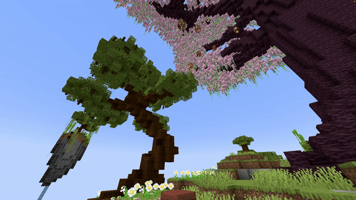

# Firework

## Parameters

<table><thead><tr><th width="161.33333333333331">Parameter</th><th width="376">Information</th><th>Example</th></tr></thead><tbody><tr><td>Location</td><td>The location to spawn the firework in the format of <code>world, x, y, z</code>.</td><td><code>world, 196.3, 64, -381.8</code></td></tr><tr><td>Velocity</td><td>Sets the velocity of the firework, used to launch a firework in a direction. If you have ShotAtAngle on false, it'll eventually automatically go upwards. Keep it at <code>0, 0, 0</code> if you want to launch it like a normal firework. Follows the pattern of <code>x, y, z</code>.</td><td><code>0.5, 1.3, 0</code></td></tr><tr><td>Colors</td><td>The colors which the firework will use. Formatted as a list of hexadecimal colors following the pattern of <code>color1, color2, color3</code> ect.</td><td><code>#ffffff, #000000</code></td></tr><tr><td>FadeColors</td><td>The fade colors of the firework, follows the same pattern as the Colors parameter. Leave it empty to not use fade colors.</td><td><code>#ffffff, #000000, #cccccc</code></td></tr><tr><td>Power</td><td>The power of the firework from <code>0</code> - <code>127</code>. Set it to <code>-1</code> to let it explode instantaneously.</td><td><code>2</code></td></tr><tr><td>FireworkShape</td><td>The shape of the firework. Can be <code>BALL</code>, <code>BALL_LARGE</code>, <code>BURST</code>, <code>CREEPER</code> or <code>STAR</code>.</td><td><code>BALL</code></td></tr><tr><td>ShotAtAngle</td><td>If set to true, it will make the firework rocket fly in a straight line, like when you shoot it with a dispenser or crossbow. You need to edit the Velocity to set the fly direction or else it won't move. Can only be set to <code>true</code> or <code>false</code>.</td><td><code>false</code></td></tr><tr><td>Flicker</td><td>Whether the explosion should flicker or not. Can only be set to <code>true</code> or <code>false</code>.</td><td><code>true</code></td></tr><tr><td>Trail</td><td>Whether the explosion should have a trail or not. Can only be set to <code>true</code> or <code>false</code>.</td><td><code>true</code></td></tr><tr><td>Delay</td><td>The amount of ticks this effect waits after the show starts before its activation.</td><td><code>40</code></td></tr></tbody></table>

<details>

<summary>YML Preset</summary>


```yaml
'1':
  Type: FIREWORK
  Location: world, 0, 0, 0
  Velocity: 0, 0, 0
  Colors: '#ffffff, #000000'
  FadeColors: ' '
  Power: 2
  FireworkShape: BALL
  ShotAtAngle: false
  Flicker: false
  Trail: false
  Delay: 0
```


</details>

## Preview

<figure><figcaption></figcaption></figure>

## Youtube Tutorial

Work in progress... :)
