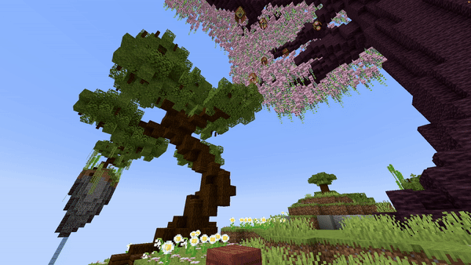

# Fountain

## Parameters

<table><thead><tr><th width="144.33333333333331">Parameters</th><th width="375">Information</th><th>Example</th></tr></thead><tbody><tr><td>Location</td><td>The origin of the fountain in the format of <code>world, x, y, z</code>.</td><td><code>world, 196.3, 64, -381.8</code></td></tr><tr><td>Velocity</td><td>Sets the velocity of falling blocks. This is used to launch falling blocks in a specific direction. Don't set these values too high (I would say around a maximum of 10). Follows the pattern of <code>x, y, z</code>.</td><td><code>1, 1.5, 0</code></td></tr><tr><td>Block</td><td>The <a href="https://hub.spigotmc.org/javadocs/bukkit/org/bukkit/Material.html">block</a> to use as falling block. Items will not work!</td><td><code>BLUE_STAINED_GLASS</code></td></tr><tr><td>BlockData</td><td>The <a href="https://minecraft.wiki/w/Block_states">block data</a> of the block (if it has any). For example an open gate, a rotated stair, ... Use <code>[]</code> to set none.</td><td>[open=true]</td></tr><tr><td>Duration</td><td>The duration of the effect (in ticks!).</td><td><code>20</code></td></tr><tr><td>Randomizer</td><td>This randomizes the value of the velocity a bit. The higher the value, the more the velocity changes. I suggest keeping this between <code>0</code> and <code>1</code>.</td><td><code>0.5</code></td></tr><tr><td>Delay</td><td>The amount of ticks this effect waits after the show starts before its activation.</td><td><code>40</code></td></tr></tbody></table>

<details>

<summary>YML Preset</summary>


```yaml
'1':
  Type: FOUNTAIN
  Location: world, 0, 0, 0
  Velocity: 0, 0, 0
  Block: BLUE_STAINED_GLASS
  BlockData: []
  Length: 20
  Randomizer: 0
  Delay: 0
```


</details>

## Preview

<figure><figcaption></figcaption></figure>

## Youtube Tutorial


