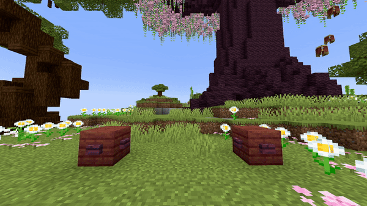

# Item Fountain Line

## Parameters

<table><thead><tr><th width="192.33333333333331">Parameters</th><th width="375">Information</th><th>Example</th></tr></thead><tbody><tr><td>FromLocation</td><td>The start location of the fountain in the format of <code>world, x, y, z</code>.</td><td><code>world, 196.3, 64, -381.8</code></td></tr><tr><td>ToLocation</td><td>The location it moves towards in the format of <code>world, x, y, z</code>.</td><td><code>world, 201.3, 64, -381.8</code></td></tr><tr><td>Velocity</td><td>Sets the velocity of the dropped items. This is used to launch items in a specific direction. Don't set these values too high (I would say around a maximum of 10). Follows the pattern of <code>x, y, z</code>.</td><td><code>1, 1.5, 0</code></td></tr><tr><td>Material</td><td>he <a href="https://hub.spigotmc.org/javadocs/bukkit/org/bukkit/Material.html">material</a> to use as item. All items work here!</td><td><code>NETHER_STAR</code></td></tr><tr><td>CustomModelData</td><td>The <a href="https://mcmodels.net/how-to-tutorials/resource-pack-tutorials/what-is-custommodeldata-2/">custom model data</a> of the item (if you want to use custom models).</td><td><code>12</code></td></tr><tr><td>Lifetime</td><td>The amount of time the dropped items should stay visible. After this time (in ticks) they'll be removed.</td><td><code>40</code></td></tr><tr><td>Randomizer</td><td>This randomizes the value of the velocity a bit. The higher the value, the more the velocity changes. I suggest keeping this between <code>0</code> and <code>1</code>.</td><td><code>0.5</code></td></tr><tr><td>Speed</td><td>The speed the origin moves from the first location to the second one. Measured in <code>blocks/s</code></td><td><code>5</code></td></tr><tr><td>Frequency</td><td>In Minecraft a new entity or particle spawns every tick, but when the speed is very high an empty space comes between two entities or particles. To fix that you can use the frequency parameter. The frequency is how many entities/particles there should be every block. This effect only activates when the speed is too big that the amount of entities or particles per block is lower than the frequency.</td><td><code>5</code></td></tr><tr><td>Delay</td><td>The amount of ticks this effect waits after the show starts before its activation.</td><td><code>40</code></td></tr></tbody></table>


## Frequency extra info

In Minecraft a new entity or particle spawns every tick, but when the speed is very high an empty space comes between two entities or particles. To fix that you can use the frequency parameter. The frequency is how many entities/particles there should be every block.&#x20;

This effect only activates when the speed is too big that the amount of entities or particles per block is lower than the frequency.&#x20;

An example is when a particle line travels 10 blocks forward with a speed of 1 and a frequency of 5. The frequency will not be activated because the speed is 1 block per second which means that there will be 20 particles on one block and 20 is bigger than 5. If we change the speed to 10 then it'll travel with 10 blocks per second. Meaning that there should normally only spawn 2 particles on every block! This is where the frequency kicks in to spawn extra particles to fill in the gap.


<details>

<summary>YML Preset</summary>


```yaml
'1':
  Type: ITEM_FOUNTAIN_LINE
  FromLocation: world, 0, 0, 0
  ToLocation: world, 0, 3, 0
  Velocity: 0, 0, 0
  Material: BLUE_STAINED_GLASS
  CustomModelData: 0
  Lifetime: 40
  Randomizer: 0
  Speed: 1
  Frequency: 5
  Delay: 0
```


</details>

## Preview

<figure><figcaption></figcaption></figure>

## Youtube Tutorial

Not yet...
