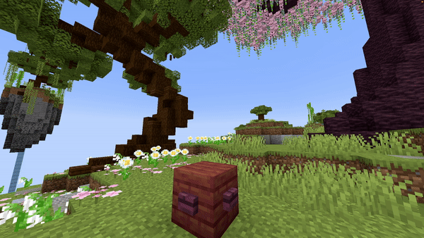

# Item Fountain

## Parameters

<table><thead><tr><th width="190.33333333333331">Parameters</th><th width="382">Information</th><th>Example</th></tr></thead><tbody><tr><td>Location</td><td>The origin of the fountain in the format of <code>world, x, y, z</code>.</td><td><code>world, 196.3, 64, -381.8</code></td></tr><tr><td>Velocity</td><td>Sets the velocity of the dropped items. This is used to launch items in a specific direction. Don't set these values too high (I would say around a maximum of 10). Follows the pattern of <code>x, y, z</code>.</td><td><code>1, 1.5, 0</code></td></tr><tr><td>Material</td><td>The <a href="https://hub.spigotmc.org/javadocs/bukkit/org/bukkit/Material.html">material</a> to use as item. All items work here!</td><td><code>DIAMOND_SWORD</code></td></tr><tr><td>CustomModelData</td><td>The <a href="https://mcmodels.net/how-to-tutorials/resource-pack-tutorials/what-is-custommodeldata-2/">custom model data</a> of the item (if you want to use custom models).</td><td><code>12</code></td></tr><tr><td>Duration</td><td>The duration of the effect (in ticks!).</td><td><code>20</code></td></tr><tr><td>Lifetime</td><td>The amount of time the dropped items should stay visible. After this time (in ticks) they'll be removed.</td><td><code>40</code></td></tr><tr><td>Randomizer</td><td>This randomizes the value of the velocity a bit. The higher the value, the more the velocity changes. I suggest keeping this between <code>0</code> and <code>1</code>.</td><td><code>0.5</code></td></tr><tr><td>Delay</td><td>The amount of ticks this effect waits after the show starts before its activation.</td><td><code>40</code></td></tr></tbody></table>

<details>

<summary>YML Preset</summary>


```yaml
'1':
  Type: ITEM_FOUNTAIN
  Location: world, 0, 0, 0
  Velocity: 0, 0, 0
  Material: BLUE_STAINED_GLASS
  CustomModelData: 0
  Length: 20
  Lifetime: 40
  Randomizer: 0
  Delay: 0
```


</details>

## Preview

<figure><figcaption></figcaption></figure>

## Youtube Tutorial

Doesn't exist yet...
