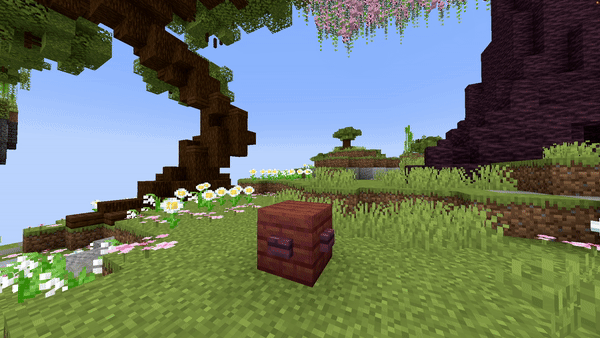

# Particle Emitter

<table><thead><tr><th width="149">Parameter</th><th width="323.3333333333333">Information</th><th>Example</th></tr></thead><tbody><tr><td>Location</td><td>The location of the particle following the format of <code>world, x, y, z</code>.</td><td><code>world, 196.3, 64, -381.8</code></td></tr><tr><td>Particle</td><td>The particle to spawn, <a href="https://hub.spigotmc.org/javadocs/spigot/org/bukkit/Particle.html">here</a> is a list of all the particles in the latest version.</td><td><code>FLAME</code></td></tr><tr><td>Amount</td><td>The amount of particles that need to be spawned.</td><td><code>200</code></td></tr><tr><td>dX</td><td>The delta X, the value of this descides how much the area where the particle spawns will extend over the x-axis.</td><td><code>1</code></td></tr><tr><td>dY</td><td>The same as dX but with the y-axis</td><td><code>1</code></td></tr><tr><td>dZ</td><td>The same as dX but with the z-axis</td><td><code>1</code></td></tr><tr><td>Force</td><td>When enabled, the player will see the particle, no matter the distance (if it is in view of course).</td><td><code>false</code></td></tr><tr><td>Length</td><td>The duration or length of the effect.</td><td><code>40</code></td></tr><tr><td>StartUp</td><td>The time it takes to display the full amount of particles. Set to <code>0</code> to disable it.</td><td><code>20</code></td></tr><tr><td>Size</td><td>The size of the particle, only works for REDSTONE, SPELL_MOB and SPELL_MOB_AMBIENT.</td><td><code>1.0</code></td></tr><tr><td>Color</td><td>The color of the particle, only works for REDSTONE, SPELL_MOB and SPELL_MOB_AMBIENT. Formatted in RGB.</td><td><code>123, 186, 92</code></td></tr><tr><td>Block</td><td>The block id of the particle, only works for BLOCK_CRACK, BLOCK_DUST, FALLING_DUST and ITEM_CRACK.</td><td><code>STONE</code></td></tr><tr><td>Delay</td><td>The amount of ticks this effect waits after the show starts before its activation.</td><td><code>40</code></td></tr></tbody></table>

<details>

<summary>YML Preset</summary>


```yaml
'1':
  Type: PARTICLE_EMITTER
  Location: world, 0, 0, 0
  Particle: SMOKE_NORMAL
  Amount: 1
  dX: 1
  dY: 1
  dZ: 1
  Force: false
  Length: 20
  StartUp: 0
  Delay: 0
```


</details>

## Preview

<figure><figcaption></figcaption></figure>

## Youtube Tutorial

Still needs to be made...
