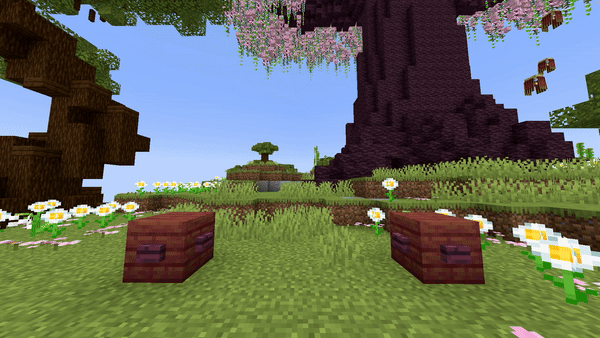

# Particle Line

## Parameters

<table><thead><tr><th width="156">Parameter</th><th width="318.3333333333333">Information</th><th>Example</th></tr></thead><tbody><tr><td>FromLocation</td><td>The start location of the particles in the format of <code>world, x, y, z</code>.</td><td><code>world, 196.3, 64, -381.8</code></td></tr><tr><td>ToLocation</td><td>The end location of the particles in the format of <code>world, x, y, z</code>.</td><td><code>world, 199.3, 62, -388.8</code></td></tr><tr><td>Particle</td><td>The particle to spawn, <a href="https://hub.spigotmc.org/javadocs/spigot/org/bukkit/Particle.html">here</a> is a list of all the particles in the latest version.</td><td><code>FLAME</code></td></tr><tr><td>Amount</td><td>The amount of particles that need to be spawned.</td><td><code>200</code></td></tr><tr><td>Speed</td><td>The speed the origin moves from the first location to the second one. Measured in <code>blocks/s</code>.</td><td><code>3</code></td></tr><tr><td>Frequency</td><td>In Minecraft a new entity or particle spawns every tick, but when the speed is very high an empty space comes between two entities or particles. To fix that you can use the frequency parameter. The frequency is how many entities/particles there should be every block. This effect only activates when the speed is too big that the amount of entities or particles per block is lower than the frequency.</td><td><code>5</code></td></tr><tr><td>dX</td><td>The delta X, the value of this descides how much the area where the particle spawns will extend over the x-axis.</td><td><code>1</code></td></tr><tr><td>dY</td><td>The same as dX but with the y-axis</td><td><code>1</code></td></tr><tr><td>dZ</td><td>The same as dX but with the z-axis</td><td><code>1</code></td></tr><tr><td>Force</td><td>When enabled, the player will see the particle, no matter the distance (if it is in view of course).</td><td><code>false</code></td></tr><tr><td>Size</td><td>The size of the particle, only works for REDSTONE, SPELL_MOB and SPELL_MOB_AMBIENT.</td><td><code>1.0</code></td></tr><tr><td>Color</td><td>The color of the particle, only works for REDSTONE, SPELL_MOB and SPELL_MOB_AMBIENT. Formatted in RGB.</td><td><code>123, 186, 92</code></td></tr><tr><td>Block</td><td>The block id of the particle, only works for BLOCK_CRACK, BLOCK_DUST, FALLING_DUST and ITEM_CRACK.</td><td><code>STONE</code></td></tr><tr><td>Delay</td><td>The amount of ticks this effect waits after the show starts before its activation.</td><td><code>40</code></td></tr></tbody></table>


## Frequency Extra Info

In Minecraft a new entity or particle spawns every tick, but when the speed is very high an empty space comes between two entities or particles. To fix that you can use the frequency parameter. The frequency is how many entities/particles there should be every block.&#x20;

This effect only activates when the speed is too big that the amount of entities or particles per block is lower than the frequency.&#x20;

An example is when a particle line travels 10 blocks forward with a speed of 1 and a frequency of 5. The frequency will not be activated because the speed is 1 block per second which means that there will be 20 particles on one block and 20 is bigger than 5. If we change the speed to 10 then it'll travel with 10 blocks per second. Meaning that there should normally only spawn 2 particles on every block! This is where the frequency kicks in to spawn extra particles to fill in the gap.


<details>

<summary>YML Preset</summary>


```yaml
'1':
  Type: PARTICLE_LINE
  FromLocation: world, 0, 0, 0
  ToLocation: world, 0, 3, 0
  Particle: SMOKE_NORMAL
  Amount: 1
  Speed: 1
  Frequency: 5
  dX: 0
  dY: 0
  dZ: 0
  Force: false
  Delay: 0
```


</details>

## Preview

<figure><figcaption></figcaption></figure>

## Youtube Tutorial

On my to do list...
