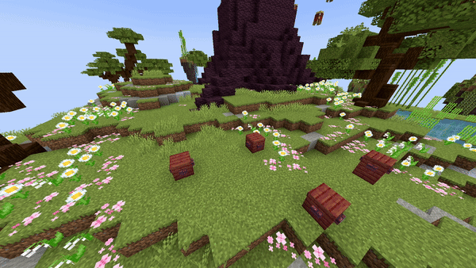

# Replace Fill

## Parameters

<table><thead><tr><th width="162.33333333333331">Parameter</th><th width="344">Information</th><th>Example</th></tr></thead><tbody><tr><td>FromLocation</td><td>The first location, comparable with the first location of the <a href="https://minecraft.wiki/w/Commands/fill">/fill</a> command. Follows the patern of <code>world, x, y, z</code>.</td><td><code>world, 196, 64, -381</code></td></tr><tr><td>ToLocation</td><td>The second location, comparable with the second location of the <a href="https://minecraft.wiki/w/Commands/fill">/fill</a> command. Follows the patern of <code>world, x, y, z</code>.</td><td><code>world, 196, 64, -381</code></td></tr><tr><td>Block</td><td>The <a href="https://hub.spigotmc.org/javadocs/bukkit/org/bukkit/Material.html">block</a> to use. Items will not work!</td><td><code>STONE</code></td></tr><tr><td>BlockData</td><td>The <a href="https://minecraft.wiki/w/Block_states">block data</a> of the block (if it has any). For example an open gate, a rotated stair, ... Use <code>[]</code> to set none.</td><td><code>[open=true]</code></td></tr><tr><td>Replacing</td><td>The <a href="https://hub.spigotmc.org/javadocs/bukkit/org/bukkit/Material.html">block</a> to replace.</td><td><code>stone</code></td></tr><tr><td>Duration</td><td>The amount of time this change has to be active. After this time it changes back to normal.</td><td><code>100</code></td></tr><tr><td>Delay</td><td>The amount of ticks this effect waits after the show starts before its activation.</td><td><code>40</code></td></tr></tbody></table>

<details>

<summary>YML Preset</summary>


```yaml
'1':
  Type: REPLACE_FILL
  FromLocation: world, 0, 0, 0
  ToLocation: world, 3, 3, 3
  Block: STONE
  BlockData: []
  Replacing: COBBLESTONE
  Duration: 100
  Delay: 0
```


</details>

## Preview

<figure><figcaption></figcaption></figure>

## Youtube Tutorial

This effect isn't that complex, you have enough info with this page right? right...?
