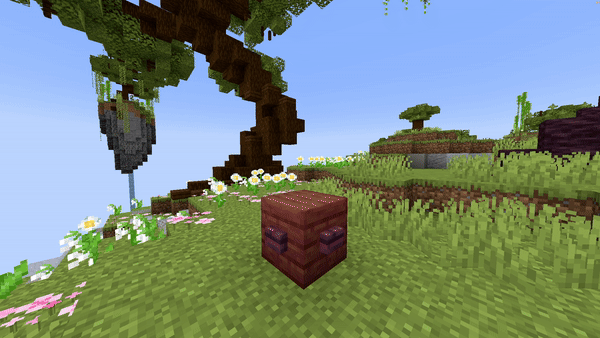

# Set Block

## Parameters

<table><thead><tr><th width="151.33333333333331">Parameter</th><th width="339">Information</th><th>Example</th></tr></thead><tbody><tr><td>Location</td><td>The location of the block.</td><td><code>world, 196, 64, -381</code></td></tr><tr><td>Block</td><td>The <a href="https://hub.spigotmc.org/javadocs/bukkit/org/bukkit/Material.html">block</a> to use. Items will not work!</td><td><code>STONE</code></td></tr><tr><td>BlockData</td><td>The <a href="https://minecraft.wiki/w/Block_states">block data</a> of the block (if it has any). For example an open gate, a rotated stair, ... Use <code>[]</code> to set none.</td><td><code>[]</code></td></tr><tr><td>Duration</td><td>The amount of time this change has to be active. After this time it changes back to normal.</td><td><code>100</code></td></tr><tr><td>Real</td><td>Whether it should spawn a real block or not. When this is set to <code>true</code>, it can't be displayed privately in private shows!</td><td><code>false</code></td></tr><tr><td>Delay</td><td>The amount of ticks this effect waits after the show starts before its activation.</td><td><code>40</code></td></tr></tbody></table>

<details>

<summary>YML Preset</summary>


```yaml
'1':
  Type: SET_BLOCK
  Location: world, 0, 0, 0
  Block: STONE
  BlockData: []
  Duration: 100
  Delay: 0
  Real: false
```


</details>

## Preview

<figure><figcaption></figcaption></figure>

## Youtube Tutorial

Just uhh, use this wiki... :)
